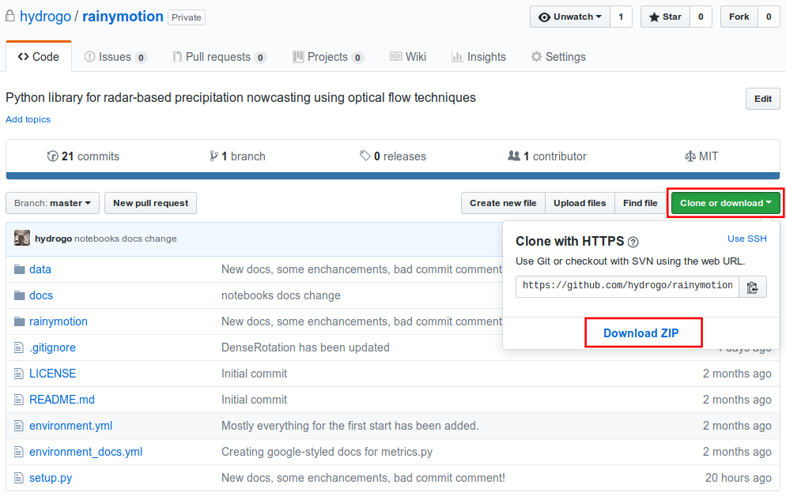

Getting Started
===============

Installation
------------

Scientific software installation always a pain. We will try all our best to describe the process clearly, but in case of any difficulties do not hesitate  to contact us (see `Contacts`_).

Installation process consists of multiple (but simple) **steps**:

**Set up Python.** Please, download and install the latest Anaconda Python3 distribution from https://www.anaconda.com/download/ which will be compatible with your OS. You can refer to `conda documentation <https://conda.io/docs/user-guide/install/index.html>`_ for a detailed installation instructions.

**Download the source code.** Unfortunately, on the current stage of development it is impossible to install ``rainymotion`` using ``pip`` or ``conda`` Python package managers. The only way we can offer you is to download the source code from the ``rainymotion`` `repository on the Github <https://github.com/hydrogo/rainymotion>`_ on your computer. This way actually has more pros, than cons: you will have not only the code, but sample data, using examples, and documentation in one place.   

To download the source code as a .zip archive you have to go to the ``rainymotion`` `repository on the Github <https://github.com/hydrogo/rainymotion>`_ and press the green button "Clone or download". Then you can extract this archive to any folder on your computer.

For users familiar with a command line and ``git`` there is the easier way to download the source code:

.. code-block:: bash

    git clone https://github.com/hydrogo/rainymotion.git

**Set up Python environment.** It is pretty common thing in software installation that something went wrong and not only installation process failed, but other software has beeb corrupted too. To avoid such a headache, it is better to use isolated python environments. To create one, you need to enter the main ``rainymotion`` directory, run a command line from there, and then run: 

.. code-block:: bash

    conda env create -f environment.yml

The command above creates the isolated python environment *rainymotion* which can be activated via command:

.. code-block:: bash

    # on Linux and MacOS
    source activate rainymotion

    # on Windows
    activate rainymotion

To come back to normal life without Python and radar-based precipitation nowcasting, in your command line run:

.. code-block:: bash

    # on linux and macOS
    source deactivate

    # on windows
    deactivate

**Installing the rainymotion package.** Firstly, be sure that you are in the main ``rainymotion`` directory, then into your command line run:

.. code-block:: bash

    python setup.py install

Well done! You have (probably) installed the ``rainymotion`` library.

**Check the installation.** To be sure that installation process had been correctly finalized, in your command line run:

.. code-block:: bash

    # 1. start Python interpreter
    python

    # 2. import rainymotion
    >>>import rainymotion

If no error is raised: good job, now you have a working python environment with the ``rainymotion`` library inside. You are ready to nowcast something. 

Quick overview
--------------

The main aim of the ``rainymotion`` library is to provide open and reliable models for radar-based precipitation nowcasting based on optical flow techniques. 

``rainymotion`` had not been writing from scratch. We incorporated the best open software solutions and provided a clue to make them work together.

.. image:: _static/rainymotionisbasedonfoss.png
   :target: _static/images/rainymotionisbasedonfoss.png

There are two general groups of models we provide for precipitation nowcasting: based on a local optical flow ( the Sparse group, and on a global optical flow (the Dense group).

Every model has the same structure, so the default workflow does not vary from model to model:

.. code-block:: bash
    
    # 0. activate rainymotion environment
    source activate rainymotion

    # 1. start Python interpreter
    python

    # 2. import rainymotion models
    >>>from rainymotion.models import Dense
    
    # 3. initialize the model instance 
    >>>model = Dense()

    # 4. transfer radar data to .input_data placeholder
    >>>model.input_data = np.load("/path/to/data")

    # 5. run the model to get nowcast
    >>>nowcast = model.run() 

You can find more examples in the :doc:`tutorials and examples <notebooks>` section.

.. _ref-contacts:

Contacts
--------

You can contact the team of developers in many ways:

- `raise an issue <https://github.com/hydrogo/rainymotion/issues>`_ in the ``rainymotion`` Github repository
- `send an email <mailto:ayzel@uni_potsdam.de>`_
- `send a message in Telegram <https://t.me/hydrogo>`_
