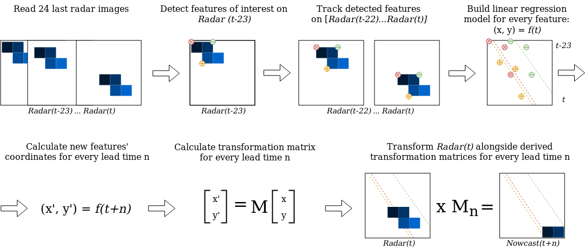
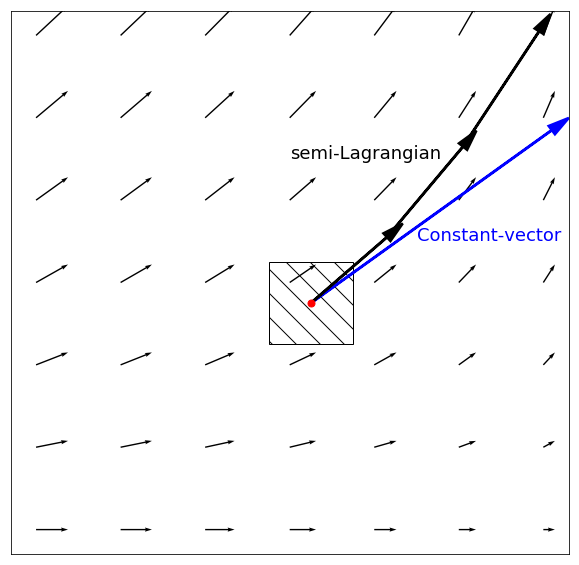
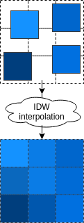

Models
======

Documentation for all precipitation nowcasting models implemented in ``rainymotion.models`` module.

For the detailed model description please refer to our paper:

.. note:: *Ayzel, G., Heistermann, M., and Winterrath, T.: Optical flow models as an open benchmark for radar-based precipitation nowcasting (rainymotion v0.1), Geosci. Model Dev. Discuss., https://doi.org/10.5194/gmd-2018-166, in review, 2018.*

The Sparse group
----------------
The central idea around this model group is to identify distinct features in a radar image that are suitable for tracking. In this context, a "feature" is defined as a distinct point ("corner") with a sharp gradient of rainfall intensity. Inside this group, we developed two models that slightly differ with regard to both tracking and extrapolation.

The SparseSD model
~~~~~~~~~~~~~~~~~~
The first model (SparseSD, SD stands for Single Delta) uses only the two most recent radar images for identifying, tracking, and extrapolating features. Assuming that *t* denotes both the nowcast issue time and the time of the most recent radar image, the implementation can be summarized as follows (Fig. 1):

* Identify features in a radar image at time *t-1* using the Shi--Tomasi  corner detector. This detector determines the most prominent corners in the image based on the calculation of the corner quality measure;
* Track these features at time *t* using the local Lucas--Kanade optical flow algorithm. This algorithm tries to identify the location of feature we previously identified on the radar image at time *t-1* on the radar image at time *t* based on the solving a set of optical flow equations in the local feature neighborhood using the least-squares approach;
* Linearly extrapolate the features’ motion in order to predict the features’ locations at each lead time *n*;
* Calculate the affine transformation matrix for each lead time *n* based on the all identified features’ locations at time *t* and *t+n* using the least-squares approach. This matrix uniquely identifies the required transformation of the last observed radar image at time *t* to obtain nowcasted images at times *t+1...t+n* providing the smallest possible difference between identified and extrapolated features' locations;
* Warp the radar image at time *t* for each lead time *n* using the corresponding affine matrix, and linearly interpolate remaining discontinuities. Warping procedure uniquely transforms each pixel location of the radar image at time *t* to its new location on the corresponding nowcasted radar images at times *t+1...t+n* and then performs linear interpolation procedure in order to interpolate nowcasted pixels' intensities to the original grid of the radar image at time *t*.

.. figure:: ./notebooks/images/sparsesd_sc.png
    :align: center
    :alt: Figure 1
    :figclass: align-center

    Figure 1. A visual representation of the SparseSD model routine.

The SparseSD model usage example:

.. code-block:: python

    # import the model from the rainymotion library
    from rainymotion.models import SparseSD

    # initialize the model
    model = SparseSD()

    # upload data to the model instance
    model.input_data = np.load("/path/to/data")

    # run the model with default parameters
    nowcast = model.run()

.. seealso::
    :doc:`notebooks`.

The Sparse model
~~~~~~~~~~~~~~~~
The Sparse model uses the 24 most recent radar images, and we consider here only features that are persistent over the whole period (of 24 timesteps) for capturing the most steady movement. Its implementation can be summarized as follows (Fig. 2):

* Identify features on a radar image at time *t-23* using the Shi--Tomasi corner detector;
* Track these features on radar images at the time from *t-22* to *t* using the local Lucas--Kanade optical flow algorithm;
* Build linear regression models which independently parametrize changes in coordinates through time (from *t-23* to *t*) for every successfully tracked feature;
* Continue with steps 3-5 of the SparseSD model routine.

    Figure 2. A visual representation of the Sparse model routine.

The Sparse model usage example:

.. code-block:: python

    # import the model from the rainymotion library
    from rainymotion.models import Sparse

    # initialize the model
    model = Sparse()

    # upload data to the model instance
    model.input_data = np.load("/path/to/data")

    # run the model with default parameters
    nowcast = model.run()

.. seealso::
    :doc:`notebooks`.

The Dense group
---------------
The Dense group of models uses the Dense Inverse Search algorithm (DIS) which allows us to explicitly estimate the velocity of each image pixel based on an analysis of two consecutive radar images.

The two models in this group differ only with regard to the extrapolation (or advection) step. The first model (the Dense) uses a constant-vector advection scheme, while the second model (the DenseRotation) uses a semi-Lagrangian advection scheme (Fig. 3).

    Figure 3. Advection schemes representation.

Both the Dense and DenseRotation models utilize a linear interpolation procedure (we use Inverse Distance Weightning approach by default) in order to interpolate advected rainfall intensities at their predicted locations to the original radar grid (Fig. 4).

    Figure 4. Interpolation of the advected pixels

The Dense model
~~~~~~~~~~~~~~~
The Dense model implementation can be summarized as follows:

* Calculate a continuous displacement field using a global DIS optical flow algorithm based on the radar images at time *t-1* and *t*;
* Use a backward constant-vector approach to extrapolate (advect) each pixel according to the obtained displacement (velocity) field, in one single step for each lead time *t+n*;
* As a result of the advection step, we basically obtain an irregular point cloud that consists of the original radar pixels displaced from their original location. We use the intensity of each displaced pixel at its predicted location at time *t+n* in order to interpolate the intensity at each grid point of the original (native) radar grid using the inverse distance weighting interpolation technique (Fig. 4).

The Dense model usage example:

.. code-block:: python

    # import the model from the rainymotion library
    from rainymotion.models import Dense

    # initialize the model
    model = Dense()

    # upload data to the model instance
    model.input_data = np.load("/path/to/data")

    # run the model with default parameters
    nowcast = model.run()

.. seealso::
    :doc:`notebooks`.

The DenseRotation model
~~~~~~~~~~~~~~~~~~~~~~~
The routine for the DenseRotation model is almost the same as for the Dense model, except differences in advection approach (the second step of the Dense model routine), which can be summarized as follows:

* Instead of using the backward constant-vector approach, we use the backward semi-Lagrangian approach to extrapolate (advect) each pixel according to the obtained displacement (velocity) field, in one single step for each lead time *t+n*. For the semi-Lagrangian scheme, we update the velocity of displaced pixels at each prediction time step by implementing a linear interpolation of obtained displacement field at time *t* to displaced pixels' locations at this (current) time step.

The DenseRoration model usage example:

.. code-block:: python

    # import the model from the rainymotion library
    from rainymotion.models import DenseRotation

    # initialize the model
    model = DenseRotation()

    # upload data to the model instance
    model.input_data = np.load("/path/to/data")

    # run the model with default parameters
    nowcast = model.run()

.. seealso::
    :doc:`notebooks`.

The Eulerian Persistence
------------------------
The (trivial) benchmark model of Eulerian persistence assumes that for any lead time *n*, the precipitation field is the same as for time *t*.

The Persistence model usage example:

.. code-block:: python

    # import the model from the rainymotion library
    from rainymotion.models import Persistence

    # initialize the model
    model = Persistence()

    # upload data to the model instance
    model.input_data = np.load("/path/to/data")

    # run the model with default parameters
    nowcast = model.run()

.. seealso::
        :doc:`notebooks`.
