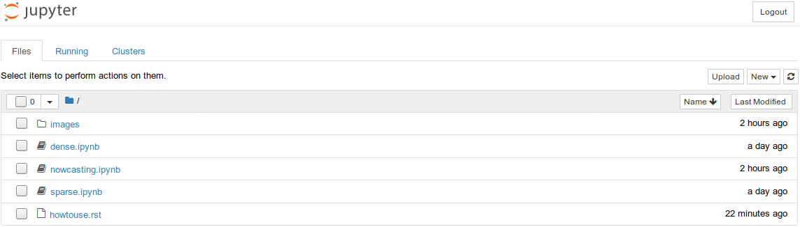

How to use?
===========

The following tutorials and examples are stored in `Jupyter notebooks <http://jupyter.org/>`_. If you want to run them on your local computer, you need to:

1. Properly install rainymotion library. Follow instructions provided in the :any:`Getting Started <../gettingstarted>` section.

2. Move to the main rainymotion directory and run the command line there.

3. In the command line enter:

.. code-block:: bash
    
    # 0. activate rainymotion environment
    source activate rainymotion

    # 1. change present directory to notebooks directory
    cd docs/source/notebooks/

    # 2. start Jupyter notebook server
    jupyter notebook
    
4. This will start the Jupyter notebook server and open a new tab in your default browser.

If you are not familiar with Jupyter notebooks, please, read `the official documentation <https://jupyter.readthedocs.io/en/latest/index.html>`_.
